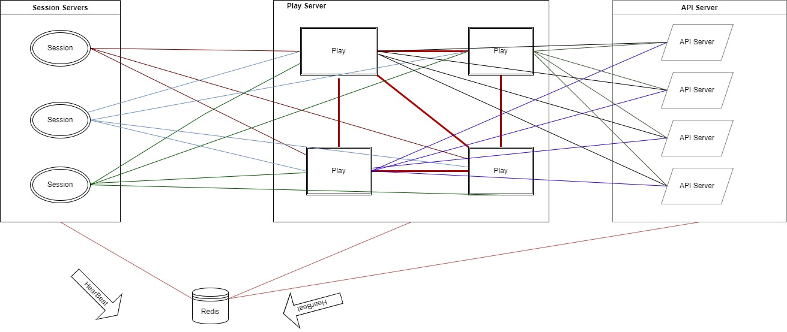
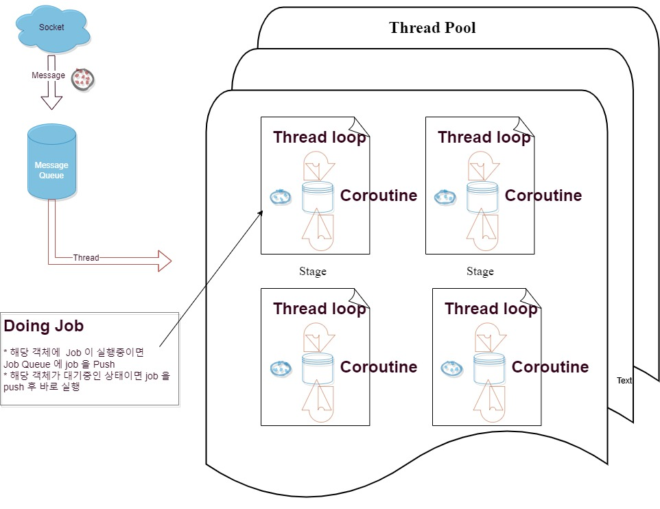
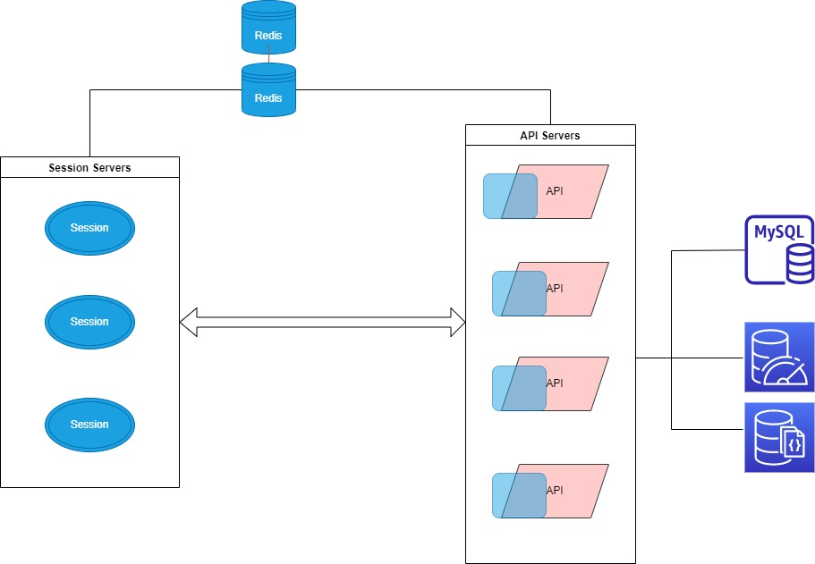
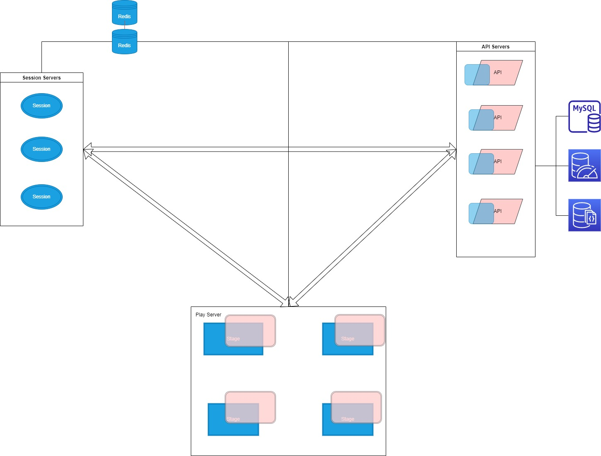
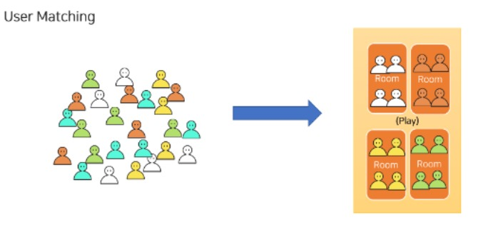
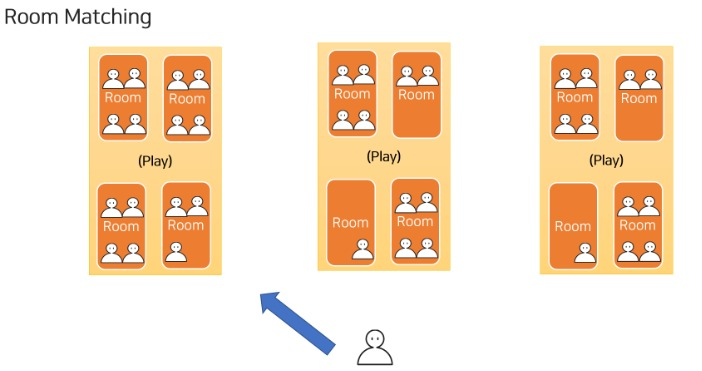
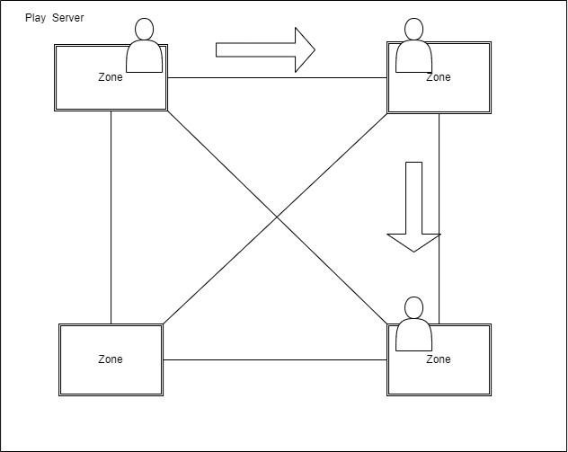
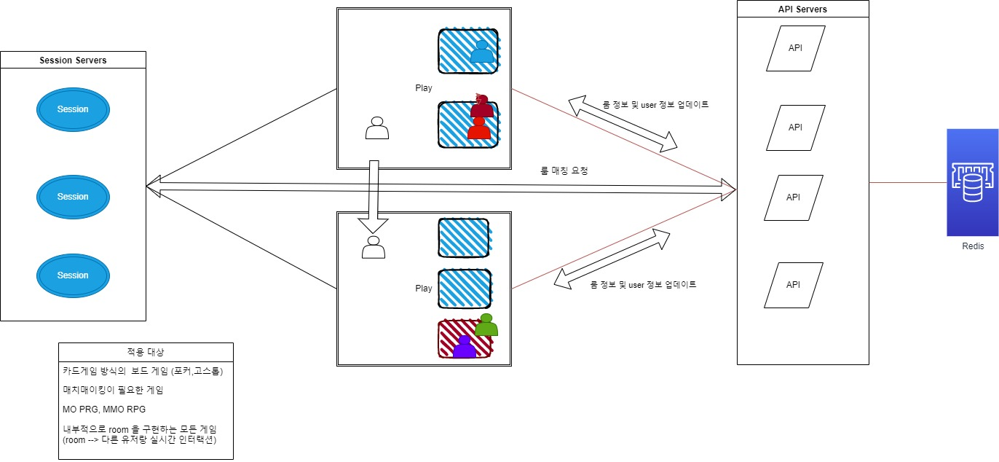
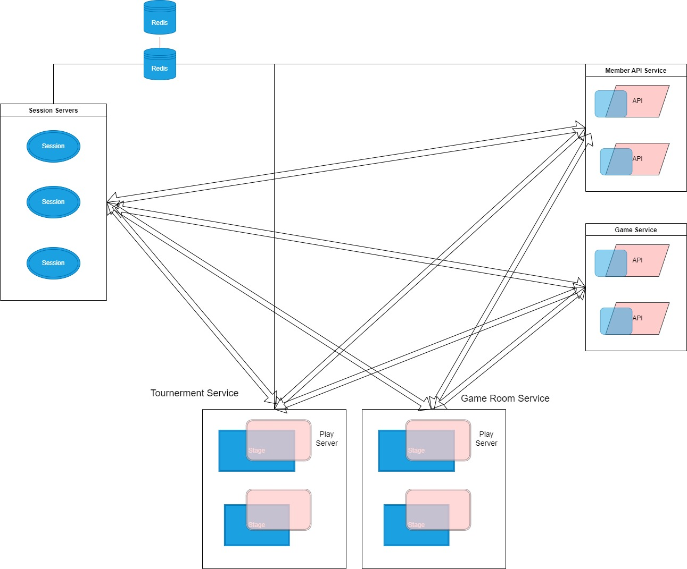

# 소개
* 실시간 게임서버 프레임워크
* 현재 버전은 0.1 입니다. 1.0 정식 버전이 나오기 전에는 production 레벨에서는 사용금지
# 프로젝트 개요
  * 이 프로젝트는 실시간 게임 서버를 쉽게 구현하기 위한 게임 서버 프레임워크 제공하려는 목적으로 만들어짐
     * 서버 개발은 크게 두가지 영역으로 나누어 지고 있음. 일반적인 웹서버 와 실시간 게임 서버 아래의 표를 보면 다음과 같은 차이점 있음

        |  | 웹서버 | 실시간 게임서버 |
        | --- | --- | --- |
        | 사용 프로토콜 | Http | tcp/websocket |
        | 서버 상태 | stateless| stateful |
        | 서버 확장 및 실시간 patch 용이성| 용이함 | 어려움
        | 연결관리 | 쉬움 | 어려움


      * 기본적으로 웹서버 형식으로 한명의 유저를 중심으로 데이터를 요청하고 처리하는 방식이라면 실시간 게임서버는 여러명의 유저가   동일한 상태 정보를 공유하면서 메시지를 처리하는 방식이기 때문에 상태정보를 유지해야 하고 실시간으로 메시지를 push 받아야 하는   특성이 존재해서 웹서버 보다 훨씬더 복잡하고 어려운 구조를 가지게 되는 특징이 있음   

     * 게다가 웹서버 프레임워크는 언어별로 다양한  프레임워크가 존재해서  (예를 들면 자바/코틀린에는 Spring MVC,Ktor C# 에서는 ASP.NET Core , NodeJs 에서는 express 와 nestJS , Python 에서는 Django,Flask,FastAPI 등) 웹서버 자체의 구현에 신경쓰지 않고   비지니스 로직 구현에만 신경을 쓰면 되는 반면 실시간 게임서버 영역은 널리 사용되는 오픈소스 프레임워크가 존재하지 않거나 있더라도 주로 c++ 버전으로 되어 있고 프로덕션 레벨에서 사용이 가능한 버전은 거의 없음 때문에 실시간 게임서버를 제작할때 이런 시스템을 개발해본 경험이 있는 경력자의 참여가 중요한 요소로 작용

     * 이렇게 된 이유는 초기에 성능상의 이유로 대부분의 실시간 게임 서버가 c++로 개발이 되었고 그뒤에도 주로 c++/c# 정도로만 개발이 되었고 게임서버의 형태도 워낙 다양하게 존재하기 때문에 그 모든 조건을 만족하는 구조로 프레임워크를 개발하기가 쉽지 않음 거기에 vm 기반의 언어 java/c# 그리고 스크립트형 언어 nodejs,python 등의 언어들이 초기에는 실시간 게임서버를 만들만한 network 라이브러리나 메모리 관리 시스템이 부족했던 이유도 있음 다만 시간이 지나면서 vm 의 성능도 크게 개선이 되고 관련 라이브러리의 추가 그리고 서버 머신의 성능 향상등 이제는 해당 언어들로도 상당수 형태의 실시간 게임을 개발하는데 부족함 없는 상황임

  
# 목표
   *  이 프로젝트의 목적은 메이저한 언어들에서 사용 할수 있는 실시간 게임 프레임워크를 제공하는 것을 목적으로 하고 있음
     시작은 Kotlin 과 C# 버전의 실시간 프레임워크를 제공하고 추후에는 C++,NodeJS,Python 까지 동일한 컨셉의 프레임워크를 제공 할 예정

# 특징
  ## 1. Full-Mesh connectivity Between servers 
  모든 서버가 Full-Mesh 형태로 서로서로 연결을 맺고 있기때문에 어떤 서버로도 메시지 전달이 가능
 
   

  ## 2. Lock Free System
  * 실시간 게임서버 개발에서 제일 복잡하고 어려운 멀티 스레드 처리와 Lock 처리를 비지니스 로직을 작성할때는 고민하지 않아도 되는 구조
  * 모든 메시징 처리는 단위별로 순차적으로 처리되는 것을 보장. 
    * Stage(Room) 에서는 room 단위로 메시지가 순차적으로 처리 
    * Api 서버에서 Account 단위로 메시지가 순차적으로 처리
    * 모든 callback 과 message handler 는 coroutine 루프 상에서 처리되도록 설계 되었기 때문에 비동기 처리가 필요한 경우 
    코루틴함수를 이용해서 복잡한  비동기 코드대신 단순한 절차식 코드로 처리가 가능




  ## 3. 웹서버 방식의 Stateless 한 구조와 실시간 게임 서버의 Stageful 한 구조를 동시에 지원
   * 두가지 방식의 조합으로 다양한 형태의 게임 시스템 제작이 가능
   * 실시간 처리가 필요 없이 기존 웹서버 형태의 게임서버만 필요하다면 그런 구조로 개발이 가능 이 경우 아래와 같은 장점이 있음
     * 커넥션 기반 인증을 처리하기 때문에 기존 웹서버 보다 인증 처리가 보안 면에서 더 안전함
     * 웹서버에 비해 실시간으로 push message 를 전달받는 것이 편하다.
     * session 에서 연결 관리및 메시지 라우팅을 해주기 때문에 동일 계정일 경우 동일한 api 서버에서 메시지를 처리하는 것을 보장한다.
     * 요청 메시지의 순차적 처리를 보장한다. 
     * 게임 초기에는 실시간 처리가 필요없더라고 언제든지 기획이 변경되어 실시간 처리가 필요한 경우가 생기는데 그경우 아무런 부담없이 실시간 처리를 위한 play 서버를 추가 할수 있다. 
     * 실시간 처리를 하는 서버와 Backend API 를 처리를 하는 서버가 분리되어 있기 때문에 필요한 경우 부하 분산 처리를 위해 Backend API  서버만 개수를 늘리거나 혹은 Play 서버만 늘리거나 줄이는 것이 가능하다.
   
   
     * 클라이언트와의 연결관리를 session 에서 전담하고 있고 stateless 한 API 서버에서 Storage 에 접근하기 때문에 특정  
      서버에 유저가 귀속될 필요가 없다. 자유롭게 User 를 서버단위로 이동시킬수 있기 때문에  MMORPG 에서 필드 구현이 가능하고  
      Room단위 게임의 경우 matching  pool 의 제한없이 시스템을 구성하는 것도 가능하다.다양한 형태의 match making 구현이 가능
      * 매칭 시스템은 크게 3가지로 나누어 보자면. 
        * 일반적인 유저간 대전을 위한 User 매칭 - 비슷한 레벨의 유저끼리 매칭
        
        * Room 매칭 - 포커,고스톱등 웹보드류 게임에서 요구하는 존재하는 기존룸에 유저를 매칭하는 방식
        
        * MMORPG 에서 필드에서 user 들을 각 Zone 에 매칭
        
      * playhouse 의 시스템을 이용해서 위의 3가지 형태의 매칭을 구현및 적용이 가능하다. 
       
     

 ## 4. 서버를 Service 별로 그룹화해서 시스템을 분리해서 운영하는 것이 가능
   * 예를 들면 아래와 같이 API 서버도 Member API 서버와 Game API 서버를 분리 할수 있고 
   * 실시간 서버도 목적과 용도에 따라서 서버군의 분리가 가능하다. 예를 들면 아래처럼  토너먼트용 서버군과 일반 서버군을  
    구성할 수 있다. 이렇게 하면 시스템의 확장성 및 안정성을 더 쉽게 확보하는 것이 가능하다.
   * 아래 그림을 보면 서버간 연결 관리가 복잡해 보이지만 Playhouse 에서는  간단한 설정 만으로 시스템을 구성할수 있다.
   

      
 ## 5. 언어별로 최대한의 성능과 호환성을 위해서 내부 네트워크 모듈은 c/c++ 을 이용해서 제작
   * 각 언어별로 위의 네트워크 모듈을 래핑하고 사용하는 방식으로 개발이 진행될 예정입니다. 
   * 성능을 위해 Memory pool 을 사용하고 패킷의 할당과 전달시 메모리 할당과 복사를 최소화 
   * 기존의 서버 프레임워크 (Spring,JPA, Asp.NET Core ,Entity FrameWork 등) 를 게임서버 개발에 최대한 활용할 수 있는 구조
  
  <br>
  
# 시작하기
 * 요구 사항
   * windows 에서는 Docker Desktop 이 설치되어 있어야 함
    * Kotlin
      * jdk17 이상
    * C#
      * .Net7 이상
 * 설치
    * C#
      ```
      git clone https://github.com/ulala-x/playhouse-net
      git clone https://github.com/ulala-x/playhouse-net-common.git

      Open PlayHouse solution with Visual Studio 2022
      ```
   * kotlin
     ```
     git clone https://github.com/ulala-x/playhouse-kotlin.git
     gradle build publishToMavenLocal
     ```
    
    * C# Connector
      ```
      git clone https://github.com/ulala-x/playhouse-connector-net.git
      Open PlayHouse solution with Visual Studio 2022
      ```

 * 사용법 및 샘플 게임 서버 실행
   * [c# 샘플](github.com/ulala-x/playhouse-net-sample/blob/main/README.md)
   * [Koltin 샘플](github.com/ulala-x/playhouse-kotlin-sample/blob/main/README.md)
 
<br>

# 아키텍처
 * 시스템 구조
   * 3가지의 모듈로 구성되어 있고 Redis가 필수 구성요소로 필요하다.
     * Session 서버
       * Client 와의 연결관리를 담당하며 client 에서 요청한 패킷을 API 혹은 Play 서버로 라우팅해주는 역활을 한다. 

     * Api 서버 
       * 흔히 사용하는 Web Backend Api 서버의 역활을 한다. 
       * Stateless 하게 동작하며 Api 서버를 통해서 DB 에 접근하는 로직을 처리한다.
       * 기존 web backend 서버와의 차이점은 소켓 연결을 위한 인증이후에는 동일한 유저의 요청은 동일한 서버에서 순차적으로  
       처리되는 것을 보장한다. 예를 들면 Client  에서 시작된 요청이 Session 서버를 통해서 API 서버로 전달 될수도 있고 Play  서버에서 실시간 로직 처리가 진행되는 도중 API 서버로 요청이 전달될수 있다. 동시에 요청이 API 서버로 전달되더라도 동일한 유저에 대한 요청은 항상 동일한 유저에게 전달되어서 순차적으로 하나씩 실행된다. 
       * 그래서 Statless 한 서버로 구성을 하지만 Local cache 를 적극적으로 사용하는것이 가능해서 DB 접근을 최소화 하면서 성능을  
       성능을 향상 시킬 수 있다.     

     * Play 서버 
       * 실시간 게임서버의 역활을 한다. 우리가 아는 Room 혹은 Dungeon 이 생성된다. 
       * 여러명의 유저가 ROOM 정보를 공유하지만 ROOM 단위로 메시지가 순차적으로 처리되는것이 보장되기 때문에 동기화를 위해서 LOCK 처리가 필요없고 제공되는 코루틴 기반의 함수를 이용해 비동기 처리가 필요한 부분을 동기식 코드로 처리가 가능하다.  

     * Redis :   
        * 서버간 동기화를 위해 redis 를 사용 각 서버는 redis 통해서 다른 서버의 주소를 알아오고 timestamp 를 통해서  
      각 서버의 상태를 확인한다. 

    
 * 주요 컴포넌트 설명
   * 공통 모듈
     * Sever - > 서버의 초기화 및 종료 관련
     * ServerInfo -> 서버의 type 및 상태, serviceId 등과 관련된 정보 제공
     * ServerInfoCenter -> 전체 서버의 목록 및 특정 서버의 정보를 제공
     * Packet -> 서버 와 클라이언트 혹은 서버와 서버간 통신에 사용되는 message 를 추상화 시킨 모듈
     * Sender -> 서버간 혹은 서버와 클라이언트간 통신에 필요한 메시지 전송 방법을 제공
  
   * Session 서버
     * SessionOption -> session 서버를 구동하기위해 필요한 옵션 및 설정
   * Api 서버 
     * ApiOption -> Api 서버를 구동하기위해 필요한 옵션 및 설정
     * ApiService -> Api 서버로 전달되는 컨텐츠 메시지를 처리하기위한 message handling service 를 제공
     * ApiCallback -> Api 서버로 전달되는 시스템적 메시지를 처리하기위한 service 제공 
   * Play 서버
     * PlayOption -> Play 서버를 구동하기 위해 필요한 옵션 및 설정
     * Stage -> Room 혹은 Dungeon 을 구현하기 위한 인터페이스
     * Actor -> Stage 에 존재하는 Actor 를 구현하기 위한 인터페이스 
     * PlayProducer -> Stage와 Actor 를 위한 생성자 함수를 등록하는 모듈
     * PacketCmd -> Stage 메시지를 처리하기 위한  handler 인터페이스 
     * PakcetHandlers -> stage 메시지 dispather 를 위한 모듈
     
<br>  

# 데이터 흐름
   * playhouse 서버의 기본 구현은 아래와 같다.
  
  

<br>

# API 문서
   * REST API 명세
   * WebSocket API 명세
   * API 사용 예제  

# 성능 테스트

<br>

# 기여하기
    * 개발 환경 설정
    * 코드 기여 방법
    * 버그 리포팅 방법
   * 코드 리뷰 가이드라인
<br>

# 라이선스
 * GNU Affero General Public License v3.0 라이센스를 적용중입니다.  
    * * * 
    GNU Affero General Public License v3.0 라이센스는 해당 소프트웨어를 사용하는 경우, 그 소프트웨어를 수정하여 만들어진 결과물을   배포하거나 공개하게 되면 해당 결과물의 소스 코드를 반드시 공개해야 합니다.그러나 해당 라이브러리를 사용하는   애플리케이션 자체의 소스 코드까지 공개할 필요는 없습니다.  즉, 단순히 라이브러리를 사용하는 경우에는,   
    해당 라이브러리의 소스 코드를 수정하지 않고 그대로 사용하는 한, 소스 코드를 공개할 필요가 없습니다. 다만, 라이브러리를  
    수정하여 사용하거나, 수정한 결과물을 배포하는 경우에는 GNU Affero General Public License v3.0을 따르며,이 경우에는 해당  
    결과물의 소스 코드를 공개해야 합니다.
    * * * 
<br>

# 문의 사항
    * 문의 방법
    * 자주 묻는 질문