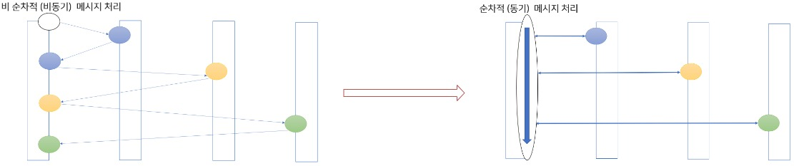

## 소개
* 실시간 게임서버 프레임워크
* 현재 버전은 0.1 입니다. 1.0 정식 버전이 나오기 전에는 production 레벨에서는 사용금지
## 프로젝트 개요
  * 이 프로젝트는 실시간 게임 서버를 쉽게 구현하기 위한 게임 서버 프레임워크를 제공하는 것을 목적으로 만들어졌습니다.
     * 서버 개발은 일반적인 웹 서버와 실시간 게임 서버 두 가지 영역으로 나눌 수 있습니다. 아래 표를 참고하면 다음과 같은 차이점이 있습니다.

        |  | 웹서버 | 실시간 게임서버 |
        | --- | --- | --- |
        | 사용 프로토콜 | Http | tcp/websocket |
        | 서버 상태 | stateless| stateful |
        | 서버 확장 및 실시간 patch 용이성| 용이함 | 어려움
        | 연결관리 | 쉬움 | 어려움
        | 데이터 처리 | 간단한 CRUD(Create, Read, Update, Delete) | 복잡한 로직 처리 및 게임 상태 유지
        | 트래픽 처리| 대체로 웹 페이지 요청에 따라 처리|대체로 높은 처리량과 대규모 접속자 수를 처리


      * 기본적으로 웹 서버는 한 명의 사용자를 중심으로 데이터를 요청하고 처리하는 방식이지만, 실시간 게임 서버는 여러 명의 사용자가 동일한 상태 정보를 공유하면서 메시지를 처리하는 방식입니다. 이러한 이유로 실시간 게임 서버는 상태 정보를 유지하고 실시간으로 메시지를 push 받아야 하는 특성이 있어 웹 서버보다 훨씬 복잡하고 어려운 구조를 가지게 됩니다.  

     * 게다가 웹 서버 프레임워크는 언어별로 다양한 프레임워크가 존재하기 때문에 (예를 들면 자바/코틀린에는 Spring MVC, Ktor, C#에서는 ASP.NET Core, Node.js에서는 Express와 NestJS, Python에서는 Django, Flask, FastAPI 등), 웹 서버 자체의 구현에 신경쓰지 않고 비즈니스 로직 구현에만 집중할 수 있습니다. 반면에 실시간 게임 서버 영역에서는 널리 사용되는 오픈소스 프레임워크가 존재하지 않거나, 있더라도 주로 C++ 버전으로 되어 있고 프로덕션 레벨에서 사용이 가능한 버전은 거의 없기 때문에 실시간 게임 서버를 제작할 때는 이러한 시스템을 개발해본 경험이 있는 경력자의 참여가 중요한 요소로 작용합니다.

     * 이러한 이유로 초기에는 성능상의 이유로 대부분의 실시간 게임 서버가 C++로 개발되었고, 이후에도 주로 C++/C# 정도로만 개발되었습니다. 또한 게임 서버의 형태가 다양하기 때문에 그 모든 조건을 만족하는 구조로 프레임워크를 개발하기가 쉽지 않았습니다. 더불어 VM 기반의 언어인 Java/C# 그리고 스크립트형 언어인 Node.js, Python 등의 언어들은 초기에는 실시간 게임 서버를 만들기에 적합한 네트워크 라이브러리나 메모리 관리 시스템이 부족했던 이유도 있습니다. 그러나 시간이 지나면서 VM의 성능이 크게 개선되었고, 관련 라이브러리가 추가되며 서버 머신의 성능도 향상되어 이제는 해당 언어들로도 상당 수의 형태의 실시간 게임을 개발하는 데 부족함이 없는 상황입니다.

  
## 목표
   *  이 프로젝트의 목적은 메이저한 언어들에서 사용할 수 있는 실시간 게임 프레임워크를 제공하는 것입니다. 초기에는 Kotlin과 C# 버전의 실시간 프레임워크를 제공하며, 추후에는 C++, Node.js, Python까지 동일한 컨셉의 프레임워크를 제공할 예정입니다.

## 특징
  ### 1. Full-Mesh connectivity Between servers 
  모든 서버가 Full-Mesh 형태로 서로서로 연결되어 있기 때문에 어떤 서버로도 메시지 전달이 가능합니다.
 
   

  ### 2. Lock Free System
  * 실시간 게임 서버 개발에서 가장 복잡하고 어려운 부분은 멀티 스레드 처리와 Lock 처리입니다. 그러나 이 프로젝트에서 제공하는 프레임워크를 사용하면 비즈니스 로직을 작성할 때 이러한 복잡한 처리에 대한 고민을 하지 않아도 됩니다. 프레임워크는 멀티 스레드 처리와 Lock 처리를 자동으로 수행하며, 이를 추상화하여 개발자가 비즈니스 로직에만 집중할 수 있도록 도와줍니다. 따라서 개발자는 실제로 게임 로직을 작성하는 데 더욱 집중할 수 있게 됩니다
  * 이 프레임워크에서는 모든 메시징 처리가 단위별로 순차적으로 처리되도록 보장됩니다. 이는 멀티 스레드 환경에서 메시지 처리가 올바르게 이루어지도록 하며, 동시에 동일한 메시지가 중복 처리되는 일을 방지합니다. 따라서 개발자는 비즈니스 로직 구현 시 메시지 처리 순서에 대해 고민할 필요 없이, 순차적으로 처리된다는 점에만 신경을 쓰면 됩니다.
  * 이 프레임워크에서는 모든 콜백(callback)과 메시지 핸들러(message handler)가 코루틴 루프(coroutine loop) 상에서 처리되도록 설계되어 있습니다. 이를 통해 비동기 처리가 필요한 경우에도 코루틴 함수를 이용하여 복잡한 비동기 코드를 단순한 절차식 코드로 처리할 수 있습니다. 따라서 개발자는 비동기 처리를 위해 콜백 지옥(callback hell)에 빠질 일 없이, 보다 직관적이고 가독성 높은 코드를 작성할 수 있게 됩니다.




  ### 3. 웹서버 방식의 Stateless 한 구조와 실시간 게임 서버의 Stageful 한 구조를 동시에 지원
   * 두가지 방식의 조합으로 다양한 형태의 게임 시스템 제작이 가능합니다.
   * 만약 실시간 처리가 필요하지 않고, 기존 웹 서버 형태의 게임 서버만 필요한 경우에도 이 프레임워크를 사용하여 개발이 가능합니다. 이 경우 기존 웹서버를 사용하는것과 비교해서 아래와 같은 장점이 있습니다.
      * 커넥션 기반 인증을 처리하기 때문에 기존 웹 서버보다 인증 처리가 보안 면에서 더 안전합니다.
      * 웹 서버에 비해 실시간으로 push message를 전달받는 것이 편합니다.
      * 세션에서 연결 관리 및 메시지 라우팅을 해주기 때문에 동일 계정일 경우 동일한 API 서버에서 메시지를 처리하는 것을 보장합니다.요청 메시지의 순차적 처리를 보장합니다.
      * 게임 초기에는 실시간 처리가 필요하지 않더라도 언제든지 기획이 변경되어 실시간 처리가 필요한 경우가 생길 수 있는데, 이 경우 아무런 부담 없이 실시간 처리를 위한 play 서버를 추가할 수 있습니다.
      * 실시간 처리를 하는 서버와 Backend API를 처리하는 서버가 분리되어 있기 때문에 필요한 경우 부하 분산 처리를 위해 Backend API 서버만 개수를 늘리거나 혹은 Play 서버만 늘리거나 줄이는 것이 가능합니다.
   
   
     * 이 프레임워크에서는 클라이언트와의 연결 관리를 세션(session)에서 전담하고 있으며, 상태를 저장하는 API 서버에서 Storage에 접근하기 때문에 특정 서버에 유저가 귀속될 필요가 없습니다. 이를 통해 개발자는 자유롭게 유저를 서버 단위로 이동시킬 수 있어, MMORPG에서 필드 구현이 가능하며, Room 단위 게임의 경우 매칭 풀(matching pool)의 제한 없이 시스템을 구성하는 것도 가능합니다. 또한 이를 통해 다양한 형태의 매치메이킹(matchmaking) 구현도 가능합니다.
      * 매칭 시스템을 크게 3가지로 나누어 볼 수 있습니다.. 
        * 일반적인 유저간 대전을 위한 User 매칭: 비슷한 레벨의 유저끼리 매칭하여 대전을 진행하는 방식입니다
        
        * Room 매칭: 포커, 고스톱 등 웹보드 게임에서 요구하는 존재하는 기존 룸에 유저를 매칭하는 방식입니다
        
        * Zone 매칭: MMORPG의 필드에서 유저들을 각 Zone에 매칭하는 방식입니다.
        
      * 따라서 이 프레임워크를 이용하여 위의 3가지 형태의 매칭을 구현하고 적용하는 것이 가능합니다.
       
     

 ### 4. 서버를 Service 별로 그룹화해서 시스템을 분리해서 운영하는 것이 가능
   * 예를 들면,API 타입의 서버의 경우 아래와 같이 API 서버를 Member API 서버와 Game API 서버로 분리할 수 있습니다. 또한, 실시간 서버도 목적과 용도에 따라 서버 군의 분리가 가능합니다. 그리고 Play 타입의 서버의 경우 아래처럼 토너먼트용 서버 군과 일반 서버 군을 구성할 수 있습니다. 이렇게 하면 시스템의 확장성과 안정성을 더 쉽게 확보할 수 있습니다. 아래 그림을 보면 서버 간 연결 관리가 복잡해 보이지만 Playhouse에서는 간단한 설정만으로 시스템을 구성할 수 있습니다.
   

      
 ### 5. 언어별로 최대한의 성능과 호환성을 위해서 내부 네트워크 모듈은 c/c++ 을 이용해서 제작
   * 각 언어별로 위의 네트워크 모듈을 래핑하고 사용하는 방식으로 개발이 진행될 예정입니다. 성능을 위해 Memory pool을 사용하고 패킷 할당과 전달 시 메모리 할당과 복사를 최소화합니다. 또한, 기존의 서버 프레임워크 (Spring, JPA, ASP.NET Core, Entity Framework 등)를 게임 서버 개발에 최대한 활용할 수 있는 구조를 제공합니다.
  
  <br>
  
## 시작하기
 * 요구 사항
   * windows 에서는 Docker Desktop 이 설치되어 있어야 합니다.
    * Kotlin
      * jdk17 이상
    * C#
      * .Net7 이상
 * 설치
    * C#
      ```
      git clone https://github.com/ulala-x/playhouse-net
      git clone https://github.com/ulala-x/playhouse-net-common.git

      Open PlayHouse solution with Visual Studio 2022
      ```
   * kotlin
     ```
     git clone https://github.com/ulala-x/playhouse-kotlin.git
     gradle build publishToMavenLocal
     ```
    
    * C# Connector
      ```
      git clone https://github.com/ulala-x/playhouse-connector-net.git
      Open PlayHouse solution with Visual Studio 2022
      ```

 * 사용법 및 샘플 게임 서버 실행
   * [c# 샘플](https://github.com/ulala-x/playhouse-net-sample/blob/main/README.md)
   * [Koltin 샘플](https://github.com/ulala-x/playhouse-kotlin-sample/blob/main/README.md)
 
<br>

## 아키텍처
 * 시스템 구조
   * 3가지의 모듈로 구성되어 있고 Redis가 필수 구성요소로 필요합니다.
     * Session 서버
       * Client 와의 연결관리를 담당하며 client 에서 요청한 패킷을 API 혹은 Play 서버로 라우팅해주는 역활을 합니다.

     * Api 서버 
       * 흔히 사용하는 Web Backend Api 서버의 역활을 합니다.
       * Stateless 하게 동작하며 Api 서버를 통해서 DB 에 접근하는 로직을 처리합니다.
       * 기존 web backend 서버와의 차이점은 소켓 연결을 위한 인증이후에는 동일한 유저의 요청은 동일한 서버에서 순차적으로 처리되는 것을 보장한다는 것입니다. 예를 들면 Client  에서 시작된 요청이 Session 서버를 통해서 API 서버로 전달 될수도 있고 Play  서버에서 실시간 로직 처리가 진행되는 도중 API 서버로 요청이 전달될 수 있습니다.하지만 동시에 요청이 API 서버로 전달되더라도 동일한 유저에 대한 요청은 항상 동일한 API 서버로 전달되어서 순차적으로 하나씩 실행이 됩니다.
       * 그래서 Statless 한 서버로 구성을 하지만 Local cache 를 적극적으로 사용하는것이 가능해서 DB 접근을 최소화 하면서 성능은 향상 시킬 수 있습니다.

     * Play 서버 
       * 실시간 게임서버의 역활을 합니다.. 우리가 아는 Room 혹은 Dungeon 이 생성을 생성 할 수 있습니다.
       * 여러명의 유저가 ROOM 정보를 공유하지만 ROOM 단위로 메시지가 순차적으로 처리되는것이 보장되기 때문에 동기화를 위해서 LOCK 처리가 필요없고 제공되는 코루틴 기반의 함수를 이용해 비동기 처리가 필요한 부분을 동기식 코드로 처리가 가능합니다. 

     * Redis :   
        * 서버간 주소 동기화를 위해 redis 를 사용합니다. 각 서버는 redis 통해서 다른 서버의 주소를 알아오고 timestamp 를 통해서 각 서버의 상태를 확인합니다.

    
 * 주요 컴포넌트 설명
   * 공통 모듈
     * Sever - > 서버의 초기화 및 종료 관련
     * ServerInfo -> 서버의 type 및 상태, serviceId 등과 관련된 정보 제공
     * ServerInfoCenter -> 전체 서버의 목록 및 특정 서버의 정보를 제공
     * Packet -> 서버 와 클라이언트 혹은 서버와 서버간 통신에 사용되는 message 를 추상화 시킨 모듈
     * Sender -> 서버간 혹은 서버와 클라이언트간 통신에 필요한 메시지 전송 방법을 제공
  
   * Session 서버
     * SessionOption -> session 서버를 구동하기위해 필요한 옵션 및 설정
   * Api 서버 
     * ApiOption -> Api 서버를 구동하기위해 필요한 옵션 및 설정
     * ApiService -> Api 서버로 전달되는 컨텐츠 메시지를 처리하기위한 message handling service 를 제공
     * ApiCallback -> Api 서버로 전달되는 시스템적 메시지를 처리하기위한 service 제공 
   * Play 서버
     * PlayOption -> Play 서버를 구동하기 위해 필요한 옵션 및 설정
     * Stage -> Room 혹은 Dungeon 을 구현하기 위한 인터페이스
     * Actor -> Stage 에 존재하는 Actor 를 구현하기 위한 인터페이스 
     * PlayProducer -> Stage와 Actor 를 위한 생성자 함수를 등록하는 모듈
     * PacketCmd -> Stage 메시지를 처리하기 위한  handler 인터페이스 
     * PakcetHandlers -> stage 메시지 dispather 를 위한 모듈
     
<br>  

## 데이터 흐름
   * playhouse 서버의 기본 구현은 아래와 같습니다.
  
  

<br>

## API 문서

## 성능 테스트

<br>

## 기여하기
    * 개발 환경 설정
    * 코드 기여 방법
    * 버그 리포팅 방법
   * 코드 리뷰 가이드라인
<br>

## 라이선스
 * GNU Affero General Public License v3.0 라이센스를 적용중입니다.  
    * * * 
    GNU Affero General Public License v3.0 라이센스는 해당 소프트웨어를 사용하는 경우, 그 소프트웨어를 수정하여 만들어진 결과물을   배포하거나 공개하게 되면 해당 결과물의 소스 코드를 반드시 공개해야 합니다.그러나 해당 라이브러리를 사용하는 애플리케이션 자체의 소스 코드까지 공개할 필요는 없습니다.즉, 단순히 라이브러리를 사용하는 경우에는,해당 라이브러리의 소스 코드를 수정하지 않고 그대로 사용하는 한, 소스 코드를 공개할 필요가 없습니다. 다만, 라이브러리를 수정하여 사용하거나, 수정한 결과물을 배포하는 경우에는 GNU Affero General Public License v3.0을 따르며,이 경우에는 해당 결과물의 소스 코드를 공개해야 합니다.
    * * * 
<br>

## 문의 사항
    * 문의 방법
    * 자주 묻는 질문